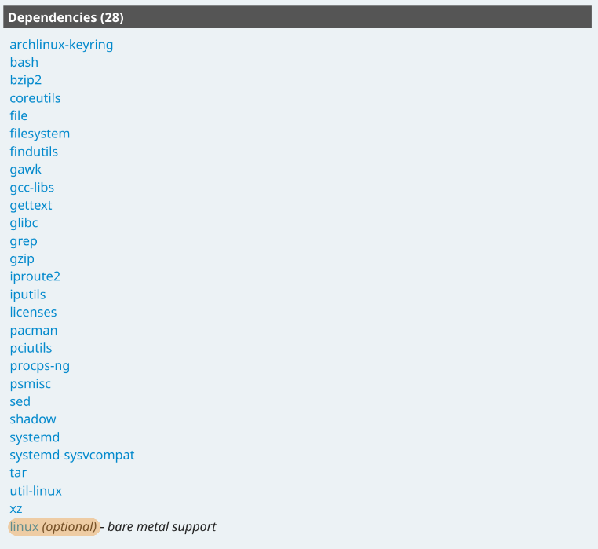
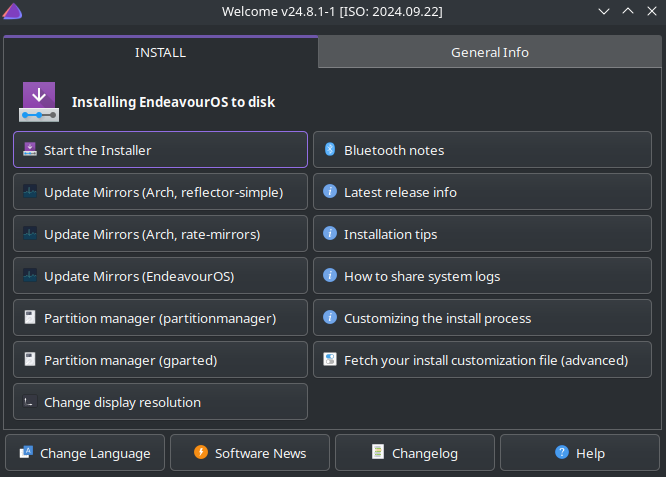

Arch Linux has a reputation for being a "difficult" distribution. I've written
previously about how that's not really something that needs to change, smoother
onboarding just isn't a part of the Arch Linux project. The appeal of Arch is
that it ships with basically no software. While the latest Ubuntu ISO is ~5.8
gigabytes, Arch's September 2025 ISO is just ~1.4 gigabytes. In fact, if you
look at the packages included as part of the base installation, you'll find a
very funny snippet to read on a website documenting a Linux distribution.

This design philosophy of build-it-yourself has lead to a number of pre-built
distributions downstream that offer more than a foundation. Not to say that
these are all "Arch but Easy", I'd liken it to using cake mix. You still have to
bake the rest of the cake, but you can outsource a few steps. That being said,
the same pitfalls apply here. You better REALLY trust Betty Crocker if you're
letting her make fundamental decisions about your cake. And in
[Betty Crocker's case](https://www.thekitchn.com/grandmas-arent-buying-boxed-cake-mix-23687784),
that's a bad idea.

##  Manjaro

Have ever wanted to run Arch while also being as plain as possible? Well, what
Ubuntu is to Debian, Manjaro is to Arch[^1]. Not nearly to the same extent,
Manjaro only established a company to offer enterprise support in 2019, but the
project overall follows Ubuntu's design philosophy of de-nerdifying the base
OS[^2]. For the most part, they've been doing that well enough for someone who
finds that appealing.

However, Manjaro comes with some [baggage](https://manjarno.pages.dev/). Manjaro
might not have tried to force
[Snaps](<https://en.wikipedia.org/wiki/Snap_(software)#Reception>) on its users,
but its Pamac utility has caused AUR outages multiple times. At the time of
writing, Manjaro has been on good behavior for a good while. 3 years is probably
long enough to say they're not going to DDoS the AUR anytime soon. My main
problem is just that there are better options these days if you want an easier
Arch experience. The [archinstall](https://github.com/archlinux/archinstall)
utility already provides a built-in installer that a normal person can use, and
there are better distributions if all you want is a graphical installer.

##  EndeavourOS

This is the "user-friendly arch" option that nearly everyone recommends, and I'm
no different. I actually used to use this distro exclusively for the GUI
installer because I had a very fragile ego and didn't want a reminder that I
wasn't smart enough for vanilla Arch. Shaming myself into ricing aside,
EndeavourOS is more like a loose collection of utilities with very little in the
way of core modifications. In terms of project philosophy, they're very close to
[upstream](<https://en.wikipedia.org/wiki/Upstream_(software_development)>).
They just include a few packages that 99% of end users[^3] will need anyway.

The most fundamental change EndeavourOS has is the use of Dracut instead of
Mkinitcpio. This is a
[_turbo-nerd_](https://en.wikipedia.org/wiki/Initial_ramdisk) topic that
involves kernel modules and firmware, but in this case it's mostly to support
Nvidia hardware. The majority of the changes come in the form of links to
relevant wiki pages and buttons that run shell scripts. In other words, it
simplifies the user experience without trying to hide the underlying complexity.
Unlike many "beginner-friendly" distros, it doesn't even try to avoid the
terminal[^4]. Even if I'm not using it, I'll always respect its approach to
onboarding via education.

##  Artix

For as long as I've used Linux, I've been using Systemd, whether I knew it or
not. I've never had a reason to dislike it, but I always thought it was a red
flag that seemingly anyone with an opinion on it thinks it's the antichrist.
Artix follows that pattern by being
[Very Opinionated](https://artixlinux.org/faq.php). Their FAQ page is a great
read, but their main criticisms come down to security and bloat[^5].

Despite this, Systemd is ubiquitous. Nearly all distros use it, so Artix has to
provide replacements for the utilities every other distro gets from it. Just
recently, this meant dropping support for the GNOME desktop environment. In my
opinion, nothing of value was lost, but it's a good example of how Artix
necessarily loses functionality. If we can ignore all nuance for a moment, their
main selling point is _not_ offering an extremely useful piece of software.
Beyond that, their reasons for doing so are even more turbo-nerdy than
initramfs. This is the only usable Linux distribution for a very specific
person, and I'm happy for them. For everyone else, just go with Arch.

##  Garuda

## CachyOS

##  SteamOS

[^1]:
    The third pillar of linux distributions, Fedora, actually follows the
    opposite pattern. Red Hat Enterprise Linux was the base, and as the name
    would imply, it was used for enterprise stuff. Fedora is the nerd-ified
    version.

[^2]:
    I vividly recall a bit of documentation insisting against calling Manjaro
    "easy arch linux" but their
    [current docs](https://wiki.manjaro.org/index.php/About_Manjaro) are very
    open about user-friendliness being their main goal, so either that changed
    or I imagined it. Probably the latter, I was in a rough spot when I first
    tried Manjaro and my memory is patchy. Anyway, thanks for reading this
    footnote, you're a real one. UPDATE: Nevermind, I didn't imagine it, they
    just have conflicting information between their
    [about page](https://wiki.manjaro.org/index.php/About_Manjaro) and their
    [FAQ](https://wiki.manjaro.org/index.php/Manjaro_FAQ). This supports my
    thesis of the project not being run very well.

[^3]:
    And that does **not** include a GUI frontend for Pacman,
    [click here to learn why](https://discovery.endeavouros.com/articles/does-endeavouros-frown-upon-gui-solutions-for-pacman/2019/11/)

[^4]:
    The words "terminal centric" are some of the first you'll find on their
    [homepage](https://endeavouros.com/)

[^5]:
    However, most of their sources come from before 2020 and are also
    opinionated, so take it with a grain of salt.
