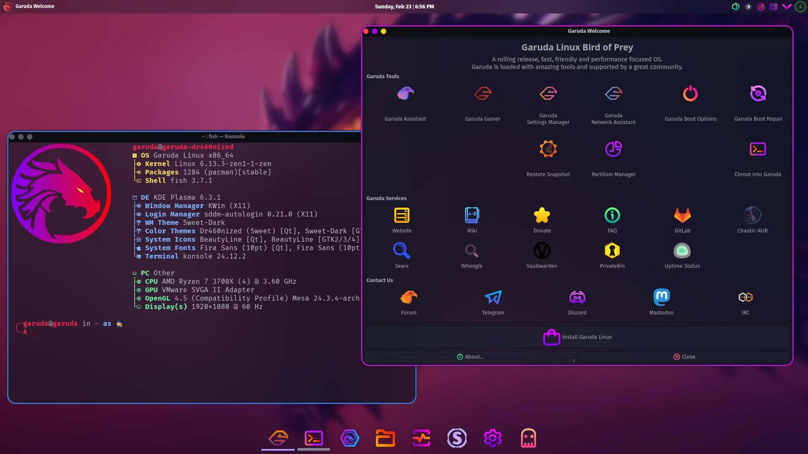

Arch Linux has a reputation for being a "difficult" distribution. I've written
previously about how that's not really something that needs to change, smoother
onboarding just isn't a part of the Arch Linux project. The appeal of Arch is
that it ships with basically no software. While the latest Ubuntu ISO is ~5.8
gigabytes, Arch's September 2025 ISO is just ~1.4 gigabytes. In fact, if you
look at the packages included as part of the base installation, you'll find a
very funny snippet to read on a website documenting a Linux distribution.

This design philosophy of build-it-yourself has lead to a number of pre-built
distributions downstream that offer more than a foundation. Not to say that
these are all "Arch but Easy", I'd liken it to using cake mix. You still have to
bake the rest of the cake, but you can outsource a few steps. That being said,
the same pitfalls apply here. You better REALLY trust Betty Crocker if you're
letting her make fundamental decisions about your cake. And in
[Betty Crocker's case](https://www.thekitchn.com/grandmas-arent-buying-boxed-cake-mix-23687784),
that's a bad idea.

##  Manjaro

Have ever wanted to run Arch while also being as plain as possible? Well, what
Ubuntu is to Debian, Manjaro is to Arch[^1]. Not nearly to the same extent,
Manjaro only established a company to offer enterprise support in 2019, but the
project overall follows Ubuntu's design philosophy of de-nerdifying the base
OS[^2]. For the most part, they've been doing that well enough for someone who
finds that appealing.

However, Manjaro comes with some [baggage](https://manjarno.pages.dev/). Manjaro
might not have tried to force
[Snaps](<https://en.wikipedia.org/wiki/Snap_(software)#Reception>) on its users,
but its Pamac utility has caused AUR outages multiple times. At the time of
writing, Manjaro has been on good behavior for a good while. 3 years is probably
long enough to say they're not going to DDoS the AUR anytime soon. My main
problem is just that there are better options these days if you want an easier
Arch experience. The [archinstall](https://github.com/archlinux/archinstall)
utility already provides a built-in installer that a normal person can use, and
there are better distributions if all you want is a graphical installer.

##  EndeavourOS

This is the "user-friendly arch" option that nearly everyone recommends, and I'm
no different. I actually used to use this distro exclusively for the GUI
installer because I had a very fragile ego and didn't want a reminder that I
wasn't smart enough for vanilla Arch. Shaming myself into ricing aside,
EndeavourOS is more like a loose collection of utilities with very little in the
way of core modifications. In terms of project philosophy, they're very close to
[upstream](<https://en.wikipedia.org/wiki/Upstream_(software_development)>).
They just include a few packages that 99% of end users[^3] will need anyway.

The most fundamental change EndeavourOS has is the use of Dracut instead of
Mkinitcpio. This is a
[_turbo-nerd_](https://en.wikipedia.org/wiki/Initial_ramdisk) topic that
involves kernel modules and firmware, but in this case it's mostly to support
Nvidia hardware. The majority of the changes come in the form of links to
relevant wiki pages and buttons that run shell scripts. In other words, it
simplifies the user experience without trying to hide the underlying complexity.
Unlike many "beginner-friendly" distros, it doesn't even try to avoid the
terminal[^4]. Even if I'm not using it, I'll always respect its approach to
onboarding via education.

##  Artix

For as long as I've used Linux, I've been using Systemd, whether I knew it or
not. I've never had a reason to dislike it, but I always thought it was a red
flag that seemingly anyone with an opinion on it thinks it's the antichrist.
Artix follows that pattern by being
[Very Opinionated](https://artixlinux.org/faq.php). Their FAQ page is a great
read, but their main criticisms come down to security and bloat[^5].

Despite this, Systemd is ubiquitous. Nearly all distros use it, so Artix has to
provide replacements for the utilities every other distro gets from it. Just
recently, this meant dropping support for the GNOME desktop environment. In my
opinion, nothing of value was lost, but it's a good example of how Artix
necessarily loses functionality. If we can ignore all nuance for a moment, their
main selling point is _not_ offering an extremely useful piece of software.
Beyond that, their reasons for doing so are even more turbo-nerdy than
initramfs. For a very specific person, this is the only usable distribution and
I'm happy for them. For everyone else, just go with Arch.

##  Garuda

Garuda is a Hindu eagle god who acts as the mount of Vishnu and also hates all
snakes everywhere forever. Garuda _Linux_ is a distribution of Arch Linux that
aims to provide a "beautiful and easy-to-use desktop experience". Both are
subjective qualities, but as long as we're talking subjectively, Garuda has the
ugliest graphical environment I've seen on Linux. It makes me glad I'm
colorblind, I'm spared the worst of it.

Other than that, Garuda is _fine_. I _guess_. There really isn't anything wrong
with it, it's just really hard to get past the aesthetic. Their coolest addition
is the Chaotic AUR, which requires a whole explanation because the AUR is both
the main advantage of using Arch Linux and the hardest part for Arch-derived
distros to implement.

### Side Quest: The AUR

The AUR (Arch User Repository) is an alternative app store where every app is
stored in a Git repository. Any user can upload whatever they want to a
repository, as long as they're legally allowed to distribute it and it meets
their submission guidelines. This sometimes includes a binary package file
(`.pkg.tar.zst`), but often it contains only the source code and a shell script
called `PKGBUILD`. This script describes how to compile a binary package from
the source code, letting many different build systems be accessed from a single
utility called `makepkg`.

If you're familiar with open-source, you've probably heard of the practice of
"compiling from source"[^6]. There are claims that compiling software yourself
gives you better performance or access to the source code gives you better
security, but the main reason the practice endures is what makes Linux a
developer's paradise. You can customize every little thing, get under the hood
and modify whatever you want. You can also receive patches significantly quicker
since you don't have to wait for a new release, but again, this is a feature for
professional computer-touchers. If that's not you, compiling from source just
means updates take about a minute longer and take a solid chunk out of your
battery life. The point here is: there's no inherent advantage to the AUR's
approach of compiling software on the user's end, it just lowers the
requirements to distribute software, which finally brings us back to Garuda and
its standout feature: the Chaotic AUR.

The Chaotic AUR aims to make installing from the AUR as seamless as possible.
It's technically its own binary package repository that you can configure pacman
to get packages from. This is unusual because most people interact with the AUR
through an AUR helper, usually `yay` or `paru`. The thing is, using an AUR
helper is already pretty seamless. I don't think most folks will notice or even
care if their packages aren't being managed by pacman directly. On top of that,
a lot of AUR packages offer a version with the `-bin` suffix,the indicating it's
been pre-compiled. The Chaotic AUR generates `-bin` packages with a couple
servers churning through recent AUR updates, compiling 24/7. This obviously
results in a ton of duplicated effort for a very niche benefit, but if that
sounds appealing, you can use it from any arch-based distro.

Putting all of this together, I struggle to find a reason to recommend Garuda,
but at the same time it's clearly found a userbase and they're having a great
time. For all I know the branding is just to keep serious people away. Honestly,
you can probably find out if this distro's for you by looking at the
screenshots.

## CachyOS

Conversely, CachyOS is a distro defined by deep technical changes that threaten
to derail this article altogether. Thankfully because of the low-level nature of
these changes, the broad strokes are all you really need to know as someone who
doesn't write kernel patches as a hobby.

So, your CPU can do a lot of things at once. If it has multiple cores it can do
even more things at once. But if the number of running programs is ever more
than the number of cores (which is always the case if you're not still on DOS),
the kernel has to decide how to portion out each core so that each program gets
at least a little bit of CPU power. This process is done by what is called a
scheduler. The way it divides CPU time is
[very complicated](<https://en.wikipedia.org/wiki/Scheduling_(computing)>), but
every millisecond the CPU is interrupted by the kernel to check if there's a
hardware signal it has to think about first. This is why your mouse moves even
when your CPU is completely slammed, the kernel forces processing your hardware
inputs to take priority over everything else.

CachyOS implements a custom scheduler that aims to increase responsiveness by
prioritizing certain programs via a "burstiness" metric. Basically, if a process
won't take a lot of CPU power to complete, it gets to go first. This on its own
would be niche and unremarkable, but CachyOS has gained an unusual amount of
popularity in a very short time. [DistroWatch](https://distrowatch.com), a
website that reports on Linux distributions[^7], has had CachyOS at the top of
its trending page for all of 2025. This is just one source, and a heavily biased
on at that, but it's worth mentioning. It's still a rock-solid distro, don't get
me wrong, just a bit overhyped.

##  SteamOS

Believe it or not, SteamOS wasn't always Arch-based! Back before the Steam Deck
and Proton, SteamOS was a Debian-based distribution meant mostly for streaming
games from a Windows PC. The move to Arch was primarily to avoid Debian's slow
release pace. Funny, you'd think that'd be a perfect fit for Valve.

The biggest difference between modern SteamOS and a standard Arch install with
matching packages is the immutable file system. SteamOS, despite the freedom it
gives you, is still built like a console operating system. When the OS is only
designed to run on a single hardware configuration, it makes sense to
standardize installations as much as possible for better support. As the name
would imply, everything is built around Steam. That's where you update your
system, change settings, and manage your files. It's honestly impressive the
level of control it gives you within a controller-focused interface. Overall,
SteamOS does a really good job giving consumers who want it to just work what
they want while also giving nerds room to mess around.

[^1]:
    The third pillar of linux distributions, Fedora, actually follows the
    opposite pattern. Red Hat Enterprise Linux was the base, and as the name
    would imply, it was used for enterprise stuff. Fedora is the nerd-ified
    version.

[^2]:
    I vividly recall a bit of documentation insisting against calling Manjaro
    "easy arch linux" but their
    [current docs](https://wiki.manjaro.org/index.php/About_Manjaro) are very
    open about user-friendliness being their main goal, so either that changed
    or I imagined it. Probably the latter, I was in a rough spot when I first
    tried Manjaro and my memory is patchy. Anyway, thanks for reading this
    footnote, you're a real one. UPDATE: Nevermind, I didn't imagine it, they
    just have conflicting information between their
    [about page](https://wiki.manjaro.org/index.php/About_Manjaro) and their
    [FAQ](https://wiki.manjaro.org/index.php/Manjaro_FAQ). This supports my
    thesis of the project not being run very well.

[^3]:
    And that does **not** include a GUI frontend for Pacman,
    [click here to learn why](https://discovery.endeavouros.com/articles/does-endeavouros-frown-upon-gui-solutions-for-pacman/2019/11/)

[^4]:
    The words "terminal centric" are some of the first you'll find on their
    [homepage](https://endeavouros.com/)

[^5]:
    However, most of their sources come from before 2020 and are also
    opinionated, so take it with a grain of salt.

[^6]:
    Hell, Gentoo is a Linux distro where every single package is compiled from
    source, even the kernel.

[^7]:
    As well as other open-source operating systems not based on Linux like
    Haiku, ReactOS, and flavors of BSD.
