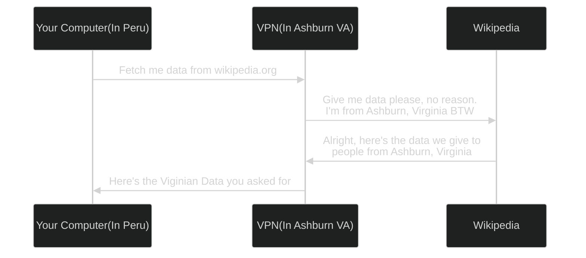
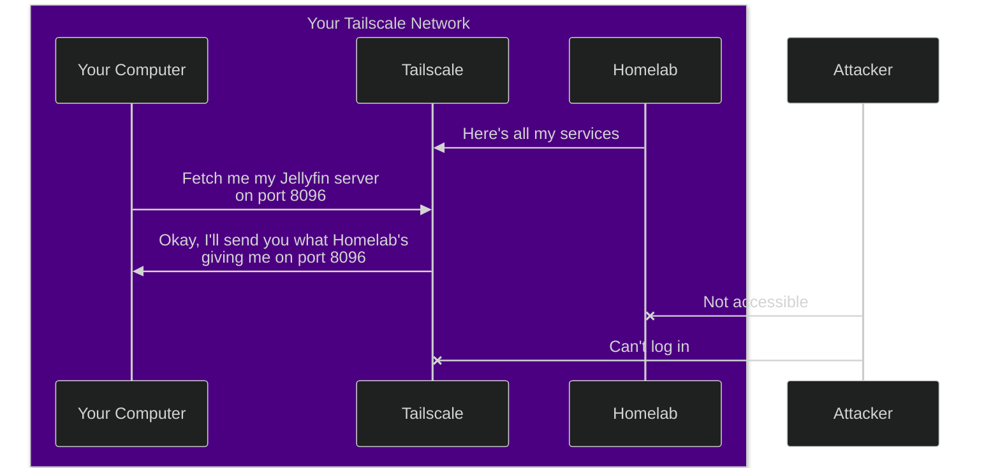

<!--markdownlint-disable MD025 MD033 MD013 MD036-->

Now, right off the bat, what the hell do I mean by "not hard, just complicated"? By that I mean homelabbing is something really easy to set up and do, provided you already have a truckload of preexisting knowledge about networking, remote administration, and Docker. It's ultimately plugging square pegs into square holes, finding out it doesn't fit, searching "square peg square hole not fitting" on StackOverflow and finding out there's a secret square hole you should be using because the obvious square hole on the front doesn't accept purple squares and this has been a problem since 1997, the secret square hole was a band-aid fix that should've been reworked years ago but now every square is built with the assumption that there are 2 slightly different square holes so fixing it now would do more harm than good.

That's ultimately what I mean by "not hard, just complicated". You're not making something from scratch, all the hard parts have already been developed, but to use them for your own ends you need to understand how they work at least a little bit. Not enough to write patches, just enough to look at an error message and know which part's broken. And that process begins with networking.

## Networking

Networking is an incredibly broad subject that can be easy to lose yourself in, but for our purposes we just need to consider how you want to access your services. All networked services run on HTTP "ports". The port number can be anywhere from 0 to 65535, and some services can use multiple ports. You can access any service simply by typing your lab's IP address followed by the port like so: `10.0.0.1:1234`. This IP is your **local** IP, meaning it's only accessible by devices connected to the same network. You can scan your local network for devices using `nmap` with the following arguments.

```bash
nmap -sP 10.0.0.1/24
```

This address is assigned by your router, and [different routers use different IP ranges](https://www.techspot.com/guides/287-default-router-ip-addresses/) for local IP addresses. You can find yours in whatever settings app you use or `fastfetch` if you're comfortable with the command line. If you aren't, you need to change that pretty soon because the most useful and flexible way to remotely access your lab is SSH.

### SSH

SSH is great. If you get into homelabbing, it will become your lifeline. Remote, root-level access to your machine is obviously incredibly powerful, which is why you'll want to do a few things to secure it first.

Before you can do anything, your lab has to be running the SSH Daemon[^1]. This is a good opportunity to get familiar with Systemd services. It's not necessary, you can technically just run `sshd` in a terminal and leave it open, but Systemd is a common way to manage these background processes. Also, if you're not using Systemd, you clearly already know enough about init systems to have opinions about them and this guide is not for you.

```bash
sudo systemctl enable --now sshd.service
#Or, if you don't want sshd to run on startup, instead run
sudo systemctl start sshd.service
#Now that the SSH server is running on the lab, you can take another computer and SSH into it with the following command
ssh user@10.0.0.1
```

When running SSH like this, it will ask you for your password every time you log in. Not only is this annoying, it's generally bad practice. Right now you're only vulnerable to attackers who are also on your Wi-Fi network, so you're not _really_ at risk, but the annoyance is reason enough to learn public key authentication.

Something I wish I'd known when I started is that it's not standard practice to generate a new key for each machine you connect to. You _can_ do that, but it requires jumping through hoops that don't exist if you just use one key to identify your client. 

```bash
#ssh-keygen is an interactive utility, so you'll need to answer its questions after running the command
ssh-keygen
Enter file in which to save the key (/home/$USER/.ssh/id_ed25519):
#The .ssh folder in your home directory is where you keep your ssh keys. For our purposes, you just need the one and the default path is fine.
Enter passphrase for "/home/$USER/.ssh/id_ed25519" (empty for no passphrase):
#You can add a passphrase here for added security, but it's not necessary for our purposes, you can just press enter
Enter same passphrase again:
#Same deal, just press enter

#If you just want to run a single command, you can use these arguments
ssh-keygen -f ~/.ssh/id_ed25519 -N ''

#Once the key is generated, we can tell our lab to accept this key with the following command. We're only sending the public key, the private key stays with you.
ssh-copy-id user@10.0.0.1
```

All set! Now that your lab is accessible remotely, you can stick it in a closet and forget about it. Barring any power outages, connectivity issues, or rats chewing on the wires, you don't have to touch the lab ever again. But that's not a huge advantage if you can only connect to it from the same network. You're really just saving yourself from hauling out a monitor and keyboard every time you want to change something. To access your lab from anywhere, we need a tool to route traffic from your lab to another public IP address. Unfortunately, exposing your lab to the public internet is a massive security risk. It's also disallowed by every major consumer <abbr title="Internet Service Provider">ISP</abbr>. What we really need is a private tunnel to route traffic through the public internet, and that service exists in the form of Tailscale.

### Tailscale

Tailscale is really just a VPN under the hood. The difference is that instead of acting as an anonymous barrier between you and the rest of the internet, it's a bridge network your devices can use to access each other from any network. Here's a simplified overview of how VPNs are traditionally used.



Tailscale, on the other hand, looks more like this.



This solution is ultimately a compromise. Ideally, we could self-host everything and be totally unreliant on outside services. There's even an open-source version of Tailscale called Headscale that allows you to self-host, so why aren't we using that? It all comes down to that public IP address. There's no realistic way to get one without renting a VPS from your favorite megacorp[^2].

[^1]: The name "Daemon" actually comes from some nerds at MIT in 1963 who took inspiration from "Maxwell's Daemon", which is a physics thought experiment that gets its name from ancient Greek definition of Daemon: an "unknown superfactor". Essentially a catch-all term for the cause of phenomenon unexplainable by reason or divinity. They're just little guys that design snowflakes and shape clouds and tangle headphone cables. Sorry to get your hopes up, homelabbing does not involve Luciferian rituals.

[^2]: There are smaller VPS landlords out there, I know Hetzner is a very popular one in Germany, but the nature of the industry favors scale. I'm not saying there's no ethical VPS vendor, I'm just saying more often than not you'll end up giving money to someone who already has way too much of it.
