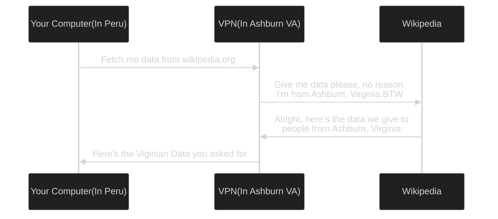
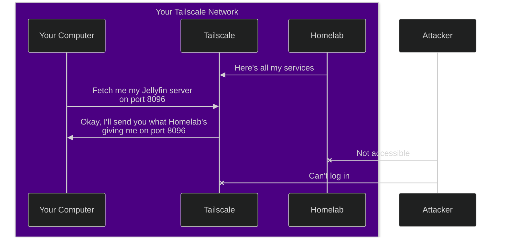

<!--markdownlint-disable MD025 MD033 MD013 MD036-->

Now, right off the bat, what the hell do I mean by "not hard, just complicated"? By that I mean homelabbing is something really easy to set up and do, provided you already have a truckload of preexisting knowledge about networking, remote administration, and Docker. It's ultimately plugging square pegs into square holes, finding out it doesn't fit, searching "square peg square hole not fitting" on StackOverflow and finding out there's a secret square hole you should be using because the obvious square hole on the front doesn't accept purple squares and this has been a problem since 1997, the secret square hole was a band-aid fix that should've been reworked years ago but now every square is built with the assumption that there are 2 slightly different square holes so fixing it now would do more harm than good.

That's ultimately what I mean by "not hard, just complicated". You're not making something from scratch, all the hard parts have already been developed, but to use them for your own ends you need to understand how they work at least a little bit. Not enough to write patches, just enough to look at an error message and know which part's broken. And that process begins with networking.

## Networking

Networking is an incredibly broad subject that can be easy to lose yourself in, but for our purposes we just need to consider how you want to access your services. All networked services run on <abbr title="HyperText Transport Protocol">HTTP</abbr> "ports". The port number can be anywhere from 0 to 65535, and some services can use multiple ports. You can access any service simply by typing your lab's IP address followed by the port like so: `10.0.0.1:1234`. This IP is your **local** IP, meaning it's only accessible by devices connected to the same network. You can scan your local network for devices using `nmap` with the following arguments.

```bash
nmap -sP 10.0.0.1/24
```

This address is assigned by your router, and [different routers use different IP ranges](https://www.techspot.com/guides/287-default-router-ip-addresses/) for local IP addresses. You can find yours in whatever settings app you use or `fastfetch` if you're comfortable with the command line. If you aren't, you need to change that pretty soon because the most useful and flexible way to remotely access your lab is <abbr title="Secure SHell">SSH</abbr>.

### SSH

SSH is great. If you get into homelabbing, it will become your lifeline. Remote, root-level access to your machine is obviously incredibly powerful, which is why you'll want to do a few things to secure it first.

Before you can do anything, your lab has to be running the SSH Daemon[^1]. This is a good opportunity to get familiar with Systemd services. It's not necessary, you can technically just run `sshd` in a terminal and leave it open, but Systemd is a common way to manage these background processes. Also, if you're not using Systemd, you clearly already know enough about init systems to have opinions about them and this guide is not for you.

```bash
sudo systemctl enable --now sshd.service
#Or, if you don't want sshd to run on startup, instead run
sudo systemctl start sshd.service
#Now that the SSH server is running on the lab, you can take another computer and SSH into it with the following command
ssh user@10.0.0.1
```

When running SSH like this, it will ask you for your password every time you log in. Not only is this annoying, it's generally bad practice. Right now you're only vulnerable to attackers who are also on your Wi-Fi network, so you're not _really_ at risk, but the annoyance is reason enough to learn public key authentication.

Something I wish I'd known when I started is that it's not standard practice to generate a new key for each machine you connect to. You _can_ do that, but it requires jumping through hoops that don't exist if you just use one key to identify your client. For minimal friction, use the key less like a physical key (i.e. many keys, one lock) and more like an ID badge (identifies you + unlocks places you're allowed to be in). 

```bash
#ssh-keygen is an interactive utility, so you'll need to answer its questions after running the command
ssh-keygen
Enter file in which to save the key (/home/$USER/.ssh/id_ed25519):
#The .ssh folder in your home directory is where you keep your ssh keys. For our purposes, you just need the one and the default path is fine.
Enter passphrase for "/home/$USER/.ssh/id_ed25519" (empty for no passphrase):
#You can add a passphrase here for added security, but it's not necessary for our purposes, you can just press enter
Enter same passphrase again:
#Same deal, just press enter

#If you just want to run a single command, you can use these arguments
ssh-keygen -f ~/.ssh/id_ed25519 -N ''

#Once the key is generated, we can tell our lab to accept this key with the following command. We're only sending the public key, the private key stays with you.
ssh-copy-id user@10.0.0.1
```

All set! Now that your lab is accessible remotely, you can stick it in a closet and forget about it. Barring any power outages, connectivity issues, or rats chewing on the wires, you don't have to touch the lab ever again. But that's not a huge advantage if you can only connect to it from the same network. You're really just saving yourself from hauling out a monitor and keyboard every time you want to change something. To access your lab from anywhere, we need a tool to route traffic from your lab to another public IP address. Unfortunately, exposing your lab to the public internet is a massive security risk. It's also disallowed by every major consumer <abbr title="Internet Service Provider">ISP</abbr>. What we really need is a private tunnel to route traffic through the public internet, and that service exists in the form of Tailscale.

### Tailscale

Tailscale is really just a <abbr title="Virtual Private Network">VPN</abbr> under the hood. The difference is that instead of acting as an anonymous barrier between you and the rest of the internet, it's a bridge network your devices can use to access each other from any network. Here's a simplified overview of how VPNs are traditionally used.


```mermaid
---
config:
  theme: 'dark'
---
sequenceDiagram
Your Computer(In Peru)->>VPN(In Ashburn VA): Fetch me data from wikipedia.org
VPN(In Ashburn VA)->>Wikipedia: Give me data please, no reason. <br/>I'm from Ashburn, Virginia BTW
Wikipedia->>VPN(In Ashburn VA): Alright, here's the data we give to <br/>people from Ashburn, Virginia
VPN(In Ashburn VA)->>Your Computer(In Peru): Here's the Viginian Data you asked for
```

Tailscale, on the other hand, looks more like this.


```mermaid
---
config:
  theme: 'dark'
---
sequenceDiagram
Box indigo Your Tailscale Network
participant Your Computer
participant Tailscale
participant Homelab
end
Homelab->>Tailscale: Here's all my services
Your Computer->>Tailscale: Fetch me my Jellyfin server <br/>on port 8096
Tailscale->>Your Computer: Okay, I'll send you what Homelab's <br/>giving me on port 8096
Attacker-xHomelab: Not accessible
Attacker-xTailscale: Can't log in
```

This solution is ultimately a compromise. Ideally, we could self-host everything and be totally unreliant on outside services. There's even an open-source version of Tailscale called Headscale that allows you to self-host, so why aren't we using that? It all comes down to that public IP address. There's no realistic way to get one without renting a <abbr title="Virtual Private Server">VPS</abbr> from your favorite megacorp[^2].

The other option for exposing a service to the public internet is Cloudflare Tunnels, but its applications are a bit more niche. Tailscale is good for letting _you_ access your services from anywhere, while a Cloudflare Tunnel lets _anyone_ access your services. This means it's really only practical if you're trying to host a website and you need more control over how it's hosted. If all you're doing is hosting a link tree or something, there are plenty other providers that fit this use case better[^3]. I actually used to host all of my services through Cloudflare Tunnels, so I know it works, but after a review of what each service _needs_, the only one I expose publicly now is Mastodon. Basically, it's bad practice to expose more than is necessary, and _very_ little is necessary.

After your network is set up, you're 90% of the way there. This is where you branch off and do whatever looks interesting with your lab. So, for a conclusion, we'll go over the general process to follow whenever you want to host a new service.

## So You Want to Host a Service

For the sake of demonstration, let's say you want to host a web app. First question is "Does it have a Container version?". Docker Containers are a consistent way to configure and run applications in a reproducible environment. For example, there's only so many HTTP ports to go around and multiple apps use port 8000 by default. It'd be a pain to learn how to change the port in a different way for every app, but with Docker we can trick the app into thinking it's running on port 8000 when it's actually on another. Just use the syntax `OUTSIDE-THE-CONTAINER:INSIDE-THE-CONTAINER` to route traffic between ports.

```yaml
services:
  web-app:
    image: web-app/server:latest
    ports:
      - 8001:8000
    volumes:
      - /mnt/ReallyHugeDrive/web-app/storage:/web-app/storage
```

Now the app can push traffic through port 8001 without any manual configuration. You probably noticed that we also added a "volumes" section, and this serves a similar purpose and syntax. Docker containers have their own storage on the root drive, but you can map storage to other folders using the same `OUTSIDE-THE-CONTAINER:INSIDE-THE-CONTAINER` syntax. This is especially useful for web apps that require a lot of storage. `/mnt` is where external drives are usually mounted, so you can see the utility in being able to tell a container to put all of its files there.

## What's Next?

But anyway, now that you have a network and a container running, that's all there is to it. Now that you have a functional lab to call your own, I'd like to take a second to suggest a few projects I recommend you self-host.

### SSHFS

<abbr title="Secure SHell File System">SSHFS</abbr> is exactly what it sounds like, a way to access files over SSH. It requires zero configuration on the server side, just an existing SSH connection. I recommend [SFTPMAN](https://github.com/spantaleev/sftpman-iced-rs) for easy configuration and management of your SSHFS directories.

### Samba

Samba is an open source implementation of the Windows <abbr title="Server Message Block">SMB</abbr> protocol. As much as I'd like you to switch to Linux, I know that's not an option for some people. Samba is how you can share files on a Linux server with a computer running Windows. Check it out at [samba.org](https://www.samba.org/), and if you run into problems, know that there's a better way… /j

### Vaultwarden

[Vaultwarden](https://github.com/dani-garcia/vaultwarden) is an open source implementation of Bitwarden's Client API. If you're already using Bitwarden, it's super easy to transition. This one's a good challenge if you're comfortable with Tailscale, since Bitwarden clients only accept traffic over <abbr title="HyperText Transfer Protocol Secure">HTTPS</abbr>. You'll have to set up <abbr title="Domain Name System">DNS</abbr>, but that's a topic for later.

### Grafana and Prometheus

These 2 are linked because they're 2 halves of one service. [Grafana](https://grafana.com/) is a web app that displays metrics. In most cases, those metrics come from [Prometheus](https://prometheus.io/), a monitoring database that collects data and feeds it to Grafana. Gathering metrics is great for monitoring your server's activity, but I put it last because configuring 2 programs to talk to each other on specific ports is a relatively complicated networking task. To simplify things, I recommend running Grafana through Docker and Prometheus through Systemd. This way, Prometheus has unrestricted access to your local network and can gather data from wherever you point it. Meanwhile, Grafana only communicates over the ports you give it, so everything is nice and tidy. A popular data source for Prometheus is the [Prometheus Node Exporter](https://prometheus.io/docs/guides/node-exporter/), which gives general statistics that are useful for all kinds of servers.

So, good luck, and don't forget to take a step back when it stops being fun. Homelabbing is popular with the kind of person that tackles problems headfirst with a righteous drive for answers. Exhaustion can creep up on you, so don't be afraid to take a break, even when you're actively pursuing a lead.

Signing off, Wheelsbot

~~_It was DNS._~~

[^1]: The name "Daemon" actually comes from some nerds at MIT in 1963 who took inspiration from "Maxwell's Daemon", which is a physics thought experiment that gets its name from ancient Greek definition of Daemon: an "unknown superfactor". Essentially a catch-all term for the cause of phenomenon unexplainable by reason or divinity. They're just little guys that design snowflakes and shape clouds and tangle headphone cables. Sorry to get your hopes up, homelabbing does not involve Luciferian rituals.

[^2]: There are smaller VPS landlords out there, I know Hetzner is a very popular one in Germany, but the nature of the industry favors scale. I'm not saying there's no ethical VPS vendor, I'm just saying more often than not you'll end up giving money to someone who already has way too much of it.

[^3]: See: Cloudflare Workers, Cloudflare Pages, Netlify, Vercel, Neocities, GitHub Pages, GitLab Pages, Codeberg Pages, SourceHut Pages, WordPress, Hostinger, Hetzner, Azure, AWS, Firebase, really anything.
