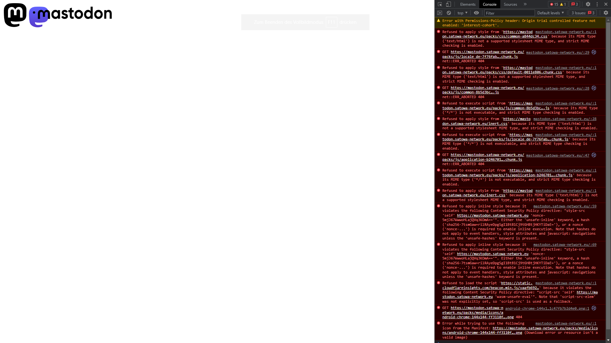

<!--markdownlint-disable MD025 MD033 MD013 MD036-->

First off, let's get one thing out of the way. You probably shouldn't do this.
There are already a ton of guides on how to host Mastodon on Debian-based
distros. If you're doing this on a fresh machine, go with Ubuntu 22.04 and use
the [official guide](https://docs.joinmastodon.org/admin/prerequisites/). Arch
isn't a great server operating system. Its whole deal is being lightweight and
getting updates to the user as fast as possible. Servers need over a terabyte to
be useful and they don't update unless it's necessary. I only did this because I
know how to administer Arch and I already had a homelab running Arch with a few
services. Regardless, if you aren't willing to switch, here's what you need to
do.

## Prerequisites

Most of what you need to host a mastodon instance is free or easy to acquire.
First, the hardware. Mastodon has very low system requirements[^1], so this is a
great project for your old clunker. It's still the most expensive part of this
setup, but if you're the kind of person to self-host a mastodon server, you
probably have more than 1 PC lying around.

[^1]:
    While the official documentation doesn't mention any recommended specs, my
    single-user instance worked fine with just 4 Gigs of RAM and an Intel Core
    i3.

Second thing that doesn't have a "free alternative" is a domain name. There are
a [ton](https://www.techradar.com/news/best-domain-registrars) of providers out
there, but for the sake of convenience I'm going to recommend
[Cloudflare](https://www.cloudflare.com/products/registrar/). We're going to be
using Cloudflare Tunnels to expose the server to the internet, and it's easier
if your domain is already registered there. To reiterate, other providers will
work just fine, they're just harder to setup for this specific use case.

Lastly, you'll need an SMTP server. This isn't strictly necessary, but the
automated installation still expects you to have one, and setting it up is
easier than going without it. Self-hosting an SMTP server is notoriously
difficult, so I'd recommend using
[any service listed in the official docs](https://docs.joinmastodon.org/user/run-your-own/#so-you-want-to-run-your-own-mastodon-server).
I went with Mailgun, but once again, all of them work fine.

## The Easy Part

Despite not being supported, the AUR has a
[mastodon](https://aur.archlinux.org/packages/mastodon) package that handles a
lot of the setup for you. There is a second postinstall set of commands you have
to run manually, which I've written below[^2].

```sh
##########################################
### Mastodon Installation Instructions ###
##########################################

### To setup Mastodon, enable and start PostgreSQL and Valkey ###
systemctl enable --now postgresql valkey

### Create the Mastodon PostgreSQL user and grant it the ability to create databases with ###
sudo -u postgres createuser -d mastodon

### Then, run the following commands ###
cd /var/lib/mastodon
sudo chown mastodon:mastodon -R .
sudo -u mastodon corepack enable --install-directory . yarn
sudo -u mastodon RAILS_ENV=production NODE_OPTIONS=--openssl-legacy-provider PATH=./:$PATH bundle exec rails mastodon:setup

### Finally, enable and start all the required services ###
systemctl enable --now mastodon.target

```

[^2]:
    The actual commands mention an Nginx server and Redis. We won't be using
    either since the [built in web server, Puma](https://github.com/puma/puma),
    does everything we need and Redis has been
    [replaced by Valkey](https://archlinux.org/news/valkey-to-replace-redis-in-the-extra-repository/)

The mastodon setup process will ask you for your domain name and SMTP
credentials, so have those ready. It will also provide an admin password, which
you need to copy and write down somewhere. In case you didn't know, you can copy
text in the terminal with <kbd>Ctrl</kbd>+<kbd>Shift</kbd>+<kbd>C</kbd>. If you
did everything right, you should see your local instance on localhost:3000.
However, since this is a very complicated process that requires a lot of
customization, something is probably broken. That means we are finally at the
fun part.

## Troubleshooting

Problem: My browser just shows a mastodon logo and nothing else.



This is a permissions problem where the web server can't access most of the
page. First, check if your mastodon directory is owned by the mastodon user.

```sh
cd /var/lib/mastodon && ls -a
```
