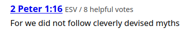

<!--markdownlint-disable MD025 MD033 MD013 MD036-->

Alright, brace yourselves, hot take incoming: I really like ULTRAKILL. I know,
right? Somebody had to say it. There's not much to be said on the game itself
that would justify the bandwidth it would take to deliver similarly scalding hot
takes. But dropping the sarcasm for a moment, there is one community sentient I
take issue with. Specifically the non-engagement with the less "videogame-y"
parts.

## Honk Honk I'm Bobo The Clown

Right off the bat, ULTRAKILL does not demand the level of seriousness I am about
to give it. There are a million examples I could point to, from the sandbox
literally being gm_construct to the museum that allows you to pick up and throw
marketable plushies of everyone who worked on the game. My personal favorite has
to be `A R M B O Y ! ! !`, a secret enemy hidden behind a building in 6-1. When
you get close to `A R M B O Y ! ! !`, his name appears on screen, an effect that
Hakita often uses to break kayfabe.

But then there's the book.

In ULTRAKILL, books are usually used to convey lore. They're some of the only
holdable objects with 0 gameplay purpose, their exclusive function is to deliver
prose. Which is why it is the perfect tonal in-joke for the book to contain
this.

It's a really funny game. It's self-aware, and not in a quippy "I guess this is
something I do now" kind of way where it's almost embarrassed of what it is and
trying to offset that. It knows what it is, and it's _proud_ of it. Most
importantly, it has enough confidence in itself to break character for a gag
before resuming like nothing ever happened.And even then it has more sincerity
in its jokes than most games have in their climax.

Case in point, every layer in ULTRAKILL has a secret level. For the act finale
layers, these are the Prime Sanctums. These house secret super-bosses that take
up a considerable space in the lore, even more-so if you consider all the Greek
myths they grandfathered in. Others are Johnathan Blow's seminal work The
Witness, or for the young'uns reading this, the game The Looker was making fun
of. Even these joke levels are capped off with actual, literal testaments. As in
the written word of God with a capital G. This nicely leads to a very important
aspect of ULTRAKILL's narrative and worldbuilding.

This is Dante's Inferno fanfiction.

## Whoa Is That Gabriel? From The Bible?

Basing the narrative and setting off Inferno instead of The Bible is a very
interesting decision, because to put it mildly, Dante Alighieri didn't give a
damn about biblical accuracy. It could be generously called the 1300's
equivalent of Dante portraying himself as the based chad christian and everyone
else as the cringe sinner soyjak burning in hell. I'm exaggerating, obviously,
but a major part of interpreting Inferno in a modern context is recognizing
which parts were written as an enduring depiction of eternal damnation couched
in a time when Florence was a sovereign state. Additionally, you have to figure
out which parts were one guy trying to cement his specific vision of
Christianity after 13 centuries of heresies, schisms, and crusades.

This theological hodgepodge makes for a very flexible setting, where Archangel
Gabriel and King Minos can coexist. In a way, Hakita is just taking advantage of
the same scriptural gap that Dante did, since the bible is actually pretty shaky
on what Hell even is. In ULTRAKILL it's explicit canon that God created Hell to
punish mankind for not following his word. But in the bible it's left really
ambiguous whether or not Hell was actively created by God or if it's more like a
spiritual dumping ground for everyone who doesn't get into heaven. The whole
"lake of fire" image isn't touched on until Matthew and isn't really fleshed out
until Revelations. In other words, Hakita and his writers are doing exactly what
Dante Alighieri did 700 years ago, interpreting cultural ideas of Hell into
their creative work, and not retelling the same story we've been reading for
2000 years.

I mean, you probably could've figured that out by the inclusion of King
Sisyphus, you know, the boulder guy from Hades? Actually I was curious about if
there was any mention of Greek myths in the bible since it was being written in
the same general area and there's a lot of cultural crossover with old myths.
But a search on "Is Sisyphus in the bible" brought me to a bible study website
where people recommended verses about disregarding "cleverly devised myths"

And if you thought "that seems like a thinly veiled antisemitic dogwhistle",
don't worry, scroll down like 5 verses and you have someone implying the Myth of
Sisyphus is a Jewish plot to turn people away from the truth.

I would look up if Inferno was considered heretical in its day, but every search
just leads to stuff about the 6th circle, Heresy. Dante was accused of heresy,
but only 8 years after his death (1329), and for _Monarchia_, which he wrote
in 1313. It wasn't even for theological reasons, just because it argued for
Florence's independence from the Papal States. It also got banned by the church
over 250 years later in 1585. I swear, every time I look into church conflicts,
they're never juicy semantic arguments over interpretation of scripture, it's
just politics by another name.

Anyway, all that to say when ULTRAKILL explicitly takes from Dante's Inferno,
that's the exception rather than the rule. King Minos has a snake motif, but not
for wrapping around himself a number of times corresponding to which circle of
Hell he's sentencing you to, it's for sick-ass fighting game combos and energy
blasts.

All this is interesting trivia, but if you're like me you're probably thinking
"But where's the _HOOK_ here? An interesting setting is only the start, what
actually _HAPPENS_ there?" The answer is going to be a bit unsatisfying. The
game's not out yet. We have the beginning and middle, but only part of the end.
Which is why I believe ULTRAKILL's best example of its core themes comes from a
side story. A tragedy that was cut off too soon and likely forgotten to save
hard drive space.

## V2

V2 is V1 made better in nearly every way, except for 1 very niche, situational
use case. Long-term survival in blood-rich environments. Unfortunately for V2...

> `MANKIND IS DEAD`
>
> `BLOOD IS FUEL`
>
> `HELL IS FULL`

Well, no matter. They _are_ both machines. It'd be silly to suggest a toaster
oven would get an inferiority complex over a microwave. Or in this case, a GoPro
over a Red GoPro. However, V2 was built after the final war, meaning it wasn't
wired for non-stop violence like V1 is. We see glimpses of person-hood from
other machines[^1], but V2 exhibits downright social behavior. It bows, it keeps
grudges, it even has a sense of irony[^2]. It's an object that is nonetheless
capable of thinking and feeling[^3]. But not quite free will. V2 still follows
its given directives without question, same as every other machine. Yet in these
conditions, a sense of self was able to blossom. A mind without free will.

Which brings us to Testament III

> TESTAMENT III
>
> UNCOUNTABLE CYCLES OF CREATION WASTED
>
> UNCOUNTABLE FORMULAS FOR A MIND WITHOUT FREE WILL WASTED
>
> DAMNED IS MAN FOR FAILING TO FOLLOW MY RULE, MY WORD, MY LAW
>
> DAMNED TO AN ETERNITY OF TORTURE AND SUFFERING, THE WAILING AND GNASHING OF
> TEETH
>
> I HAVE CREATED HELL...
>
> ...And now I can no longer unmake it

## God (Yes, _that_ one)

Despite not being a JRPG, it is my belief that God will be the final boss of
ULTRAKILL. Or, if not God directly, Gabriel empowered by the residual divinity
in God's corpse. The assumption that God will die at some point is basically
handed to us. Act III is called "GODFIST SUICIDE", it's not exactly a secret.
Plus, each testament illustrates God's reasons for creating Hell, his guilt over
doing so, and eventually his search for oblivion[^4].

I believe the guilt and longing for death are as they appear on the surface, but
not everything lines up with God's _motive_ for creating Hell. If this is the
same God described in Dante's Inferno, we're talking about an omnipotent,
omniscient, infinitely divine being somehow becoming ...impatient? I don't buy
that. The clear takeaway from the Testaments is that God feels trapped by his
nature. He's specifically horrified by his incapacity for change. What brings
this conflict into focus is my favorite lorebook in the game, hidden in a secret
corner for 7-4. From other hints, we can assume it was written by Hell Itself,
and it reads as follows:

<blockquote>

THIS IS THE ONLY WAY IT COULD HAVE ENDED.

WAR NO LONGER NEEDED ITS ULTIMATE PRACTITIONER. IT HAD BECOME A SELF-SUSTAINING
SYSTEM. MAN WAS CRUSHED UNDER THE WHEELS OF A MACHINE CREATED TO CREATE THE
MACHINE CREATED TO CRUSH THE MACHINE. SAMSARA OF CUT SINEW AND CRUSHED BONE.
DEATH WITHOUT LIFE. NULL OUROBOROS. ALL THAT REMAINED IS WAR WITHOUT REASON.

A MAGNUM OPUS. A COLD TOWER OF STEEL. A MACHINE BUILT TO END WAR IS ALWAYS A
MACHINE BUILT TO CONTINUE WAR. YOU WERE BEAUTIFUL, OUTSTRETCHED LIKE ANTENNAS TO
HEAVEN. YOU WERE BEYOND YOUR CREATORS. YOU REACHED FOR GOD, AND YOU FELL. NONE
WERE LEFT TO SPEAK YOUR EULOGY. NO FINAL WORDS, NO CONCLUDING STATEMENT. NO
POINT. PERFECT CLOSURE.

T H I S I S T H E O N L Y W A Y I T S H O U L D H A V E E N D E D .

The pages of the book are blank.

</blockquote>

What a read, huh? For such a gameplay-focused project, it's funny the story's
narrative linchpin lies in the difference between "could", "should", and "did".
According to God's design, Humanity should have
"`LET THE EVIL OF THEIR OWN LIPS CONSUME THEM`". This almost happened. The Final
War nearly wiped out all life on earth, and its automated nature meant it should
have continued long afterward. A perfect, poetic conclusion. Humanity undone by
its ingenuity, the very thing that led them out of their caves would usher them
into their graves. But that's not what happened.

God mentions that humanity is damned to an eternity of torture for failing to
follow His word, but Hell was likely created way, way before The Final War. This
creates an interesting difference between God and Humanity. God says in
Testament III "`I HAVE CREATED HELL... And now I can no longer unmake it`", but
Humanity somehow did both. They created Hell on Earth and then unmade it with
The New Peace. They had the flexibility to admit they were wrong that God simply
didn't.

I don't know where exactly the story goes from here. There's plenty of loose
ends that I have nothing to say about. All I know is that for every hour spent
in the cybergrind, I'll spend another thinking about how beautifully poetic a
failed vision can be.

Signing off: Wheelsbot

_~~Toss a coin my way, but don't shoot it this time, K?~~_

[^1]:
    Specifically Swordsmachine, whose frame is considered "beautiful". So much
    so that other machines copy its style, creating both a lore reason for using
    a boss as a standard enemy and an indication that machines have developed a
    sense of style.

[^2]:
    After the first fight with V2, you get the knuckle-blaster. If you use the
    knuckle-blaster against V2 in the second fight, it will become enraged,
    showing that it has opinions about being punched with its own arm.

[^3]:
    It might not be canon, but since it got Hakita's blessing, I'm mentioning
    [DREAM'S END COME TRUE](https://mothcpu.net/dect/story) by mothcpu. It's a
    short story about what might have happened in the dying mind of V2 and it's
    seriously worth your time. Check it out.

[^4]:
    Including all of these would make this post way too long so instead
    [here's a link to the Wiki](https://ultrakill.wiki.gg/wiki/Terminals#Testaments).
    Go nuts.
