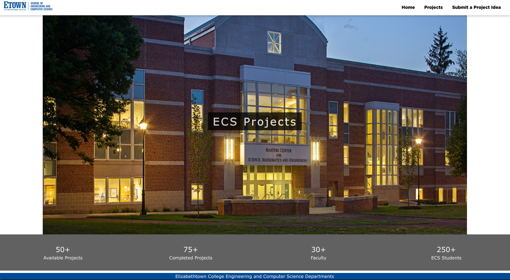

A frontend website for reading and submitting project ideas through a database

Some info that users would be submitting to the database include:

- Who made the project request
- The requirements for said project
- Who is currently working on it
- Where the project currently is in development
- The location of the project’s git repository
