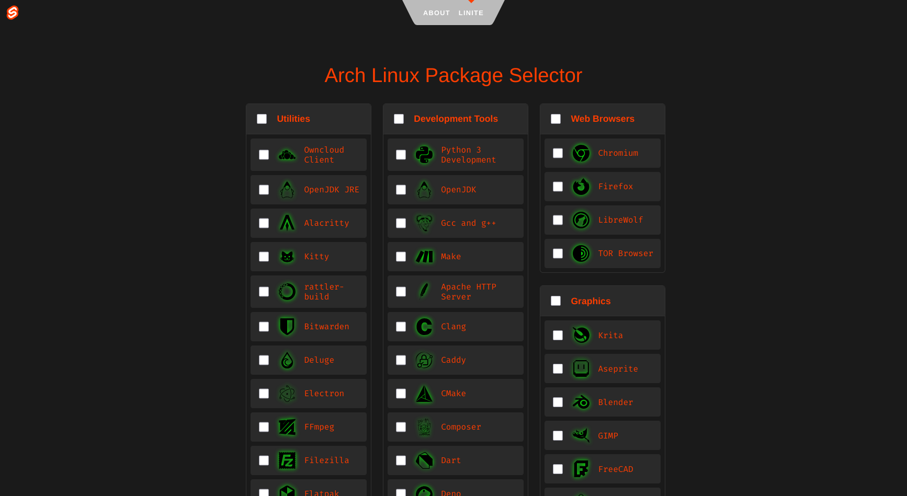

This project was heavily based on jplsek's
[website of the same name](https://jplsek.github.io/Linite/). I used the tool
many times when distrohopping, but having not been updated in 10 years, it was
in need of a tune-up.

The most urgent change was updating the selection of packages. I experimented
with automating scraping official repositories, but there were too many
incongruities between the names of packages and the software itself. I ended up
searching through packages manually and compiling them into JSON files that
would then be parsed into an interactive web app using Svelte.

You can find the tool [here](https://linite-reloaded.vercel.app).
